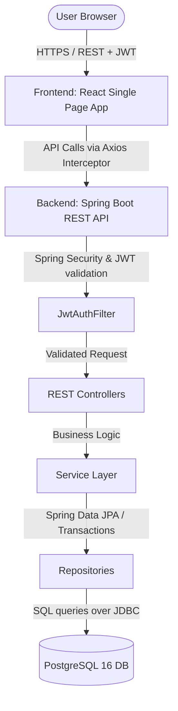
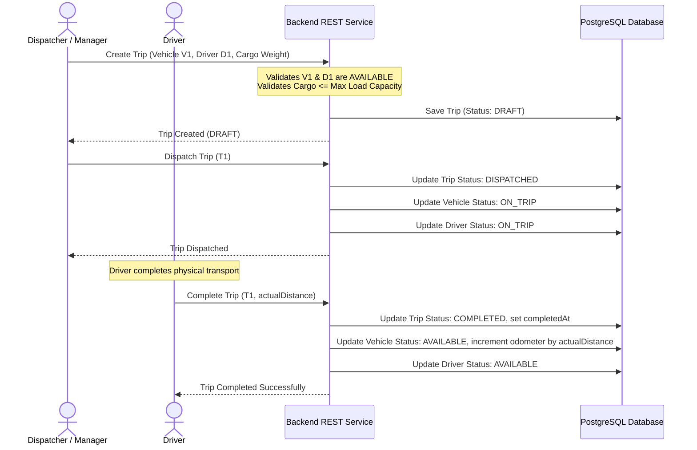
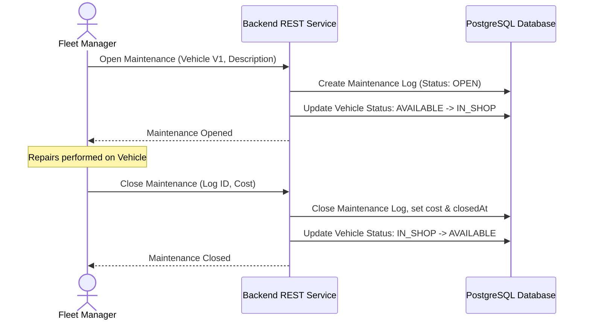

# TransitOps: Smart Transport Operations Platform

An enterprise-grade, role-based fleet management and transit logistics platform designed to optimize vehicle utilization, automate dispatching workflows, track expenses, and monitor real-time operational efficiency.

> **Project Banner**
> 
> ```md
> 
> ```

---

## Table of Contents
1. [Overview](#overview)
    - [Problem Statement](#problem-statement)
    - [Solution](#solution)
    - [Objectives](#objectives)
2. [Features](#features)
    - [Core Features](#core-features)
    - [User Roles & Permissions](#user-roles-permissions)
    - [Key Functionalities](#key-functionalities)
    - [AI & ML Features](#ai--ml-features)
3. [Tech Stack](#tech-stack)
4. [System Architecture](#system-architecture)
    - [Architecture Diagram](#system-architecture)
    - [Core Workflows](#core-workflows)
5. [Getting Started](#getting-started)
    - [Prerequisites](#prerequisites)
    - [Environment Configuration](#environment-configuration)
    - [Database Setup](#database-setup)
    - [Backend Setup](#backend-setup)
    - [Frontend Setup](#frontend-setup)
6. [Testing](#testing)
7. [API Reference Summary](#api-reference-summary)
8. [License & Support](#license--support)

---

# Overview

### Problem Statement
Managing a commercial transport fleet involves complex coordination between vehicles, drivers, maintenance schedules, fuel logging, and operational expenses. Without an integrated real-time tracking system, companies face underutilized assets, high fuel costs due to unmonitored routes, unexpected vehicle breakdowns, and lack of clarity on the Return on Investment (ROI) of individual fleet components.

### Solution
**TransitOps** is a Smart Transport Operations Platform that centralizes fleet management, driver dispatching, maintenance scheduling, and financial analytics. It enables real-time monitoring of vehicles and drivers, optimizes workflows with robust state validation, keeps detailed logs of fuel and expenses, and calculates real-time profitability and fuel efficiency metrics.

### Objectives
* **Maximize Asset Utilization:** Provide real-time status tracking for vehicles and drivers to ensure minimal idle time.
* **Streamline Operations:** Enforce strict business logic for trip dispatching, cancellation, and completion.
* **Reduce Maintenance Costs:** Track maintenance logs and alert managers to transition vehicles to shop status, avoiding on-road failures.
* **Provide Financial Transparency:** Automatically compute metrics like per-vehicle Return on Investment (ROI) and operational costs.
* **Seamless Role-Based Access:** Enforce proper security segregation for managers, drivers, dispatchers, and financial analysts.

---

# Features

### Core Features
* **Vehicle Asset Tracking:** Track vehicle registration, maximum capacity, odometer, and operational states (`AVAILABLE`, `ON_TRIP`, `IN_SHOP`, `RETIRED`).
* **Driver Management:** Track driver license details, contact information, and duty states (`AVAILABLE`, `ON_TRIP`, `INACTIVE`).
* **Trip Dispatch Workflow:** Plan, dispatch, complete, and cancel cargo trips. Enforces rules ensuring vehicle capacity is not exceeded and that only available drivers/vehicles are dispatched.
* **Maintenance Logs:** Keep a detailed history of vehicle service events, changing vehicle status to `IN_SHOP` during active repairs and back to `AVAILABLE` on completion.
* **Expense & Fuel Logger:** Record fuel purchases (liters, cost, odometer) and other operational expenses (tolls, repairs, miscellaneous).
* **ROI & Financial Analytics:** High-fidelity analytics dashboards calculating per-vehicle ROI, fuel efficiency (KM/Liter), and aggregate operational costs, with support for exporting CSV reports.

### User Roles & Permissions
The platform uses Spring Security and JWT-based authentication to enforce role-based access control (RBAC):

| Role | Description | Permissions & Responsibilities |
| :--- | :--- | :--- |
| **`FLEET_MANAGER`** | Oversees all fleet operations and assets. | Full read/write access to Vehicles, Drivers, Trips, Maintenance, Expenses, and ROI reports. |
| **`DISPATCHER`** | Coordinates scheduling and routes. | Read access to fleet; Write access to create/dispatch/cancel Trips; Log fuel and expenses. |
| **`DRIVER`** | Executes the physical transport runs. | View assigned Trips; Complete Trips; Log fuel purchases and expenses. |
| **`SAFETY_OFFICER`** | Monitors compliance and safety. | Read-only access to fleet, trips, and maintenance; Create/update Driver files and licensing. |
| **`FINANCIAL_ANALYST`** | Tracks expenditures and yields. | Full read/write access to Expenses, Fuel logs, ROI reports, and CSV data exports. |

### Key Functionalities
* **State Synchronization:** Triggering a trip dispatch automatically locks the vehicle and driver to `ON_TRIP`. Completing the trip releases them back to `AVAILABLE` and increments the vehicle odometer.
* **Capacity Safeguard:** Prevent assigning cargo weights that exceed the vehicle's licensed maximum capacity.
* **Stateless Authentication:** Secure logins generating JWT tokens signed on the server and stored client-side in local storage.

### AI & ML Features
* **TODO:**
  - **Predictive Maintenance:** Analyze expense and mileage history to predict component failures.
  - **Route Optimization:** Machine learning models to calculate the most fuel-efficient transit path based on historical trip records.
  - **Fuel Demand Forecasting:** Predict next-month fuel requirements based on scheduled trips and seasonality.

---

# Tech Stack

### Frontend
| Technology | Version | Description |
| :--- | :--- | :--- |
| **React** | `19.1.1` | UI Library (using modern Hooks and functional components) |
| **Vite** | `7.1.7` | Frontend Build Tool and Dev Server |
| **React Router DOM** | `7.18.1` | Client-Side Routing |
| **TanStack React Query** | `5.101.2` | Server State Management and Caching |
| **Axios** | `1.18.1` | HTTP client with automatic JWT bearer authorization interceptor |
| **React Hook Form** | `7.81.0` | Flexible and performant form validation |
| **Zod** | `4.4.3` | Schema declaration and validation library |
| **React Hot Toast** | `2.6.0` | Global toast notifications |
| **CSS (Vanilla)** | N/A | Custom stylesheet based on Odoo Enterprise Light-Mode design system |

### Backend
| Technology | Version | Description |
| :--- | :--- | :--- |
| **Java** | `17` | Language Runtime |
| **Spring Boot** | `4.1.0` | Core Web Framework (Starter Web, Starter Test) |
| **Spring Security** | `4.1.0` | Authentication & Role-Based Authorization Framework |
| **Spring Data JPA** | `4.1.0` | Data persistence abstraction over Hibernate ORM |
| **Jakarta Validation** | `3.0.2` | Annotations for request body validation |
| **Project Lombok** | `1.18.30` | Boilerplate reduction (Getter, Setter, NoArgsConstructor) |

### Database
| Technology | Version | Description |
| :--- | :--- | :--- |
| **PostgreSQL** | `16` | Relational Database Management System |

### AI/ML
| Technology | Version | Description |
| :--- | :--- | :--- |
| **TODO** | N/A | Integrated ML prediction scripts (Planned for v2.0) |

### DevOps
| Technology | Version | Description |
| :--- | :--- | :--- |
| **Docker** | `24.x+` | Containerization platform |
| **Docker Compose** | `3.8` | Multicontainer orchestration (used to run PostgreSQL database) |
| **Maven Wrapper** | `3.9+` | Build tool bootstrapping for Java applications |

### Cloud
| Provider | Service | Description |
| :--- | :--- | :--- |
| **TODO** | N/A | Production cloud hosting (Planned: AWS ECS/RDS or GCP Cloud Run/Cloud SQL) |

### Tools
| Tool | Purpose |
| :--- | :--- |
| **ESLint** | Frontend code linting and standard validation |
| **Git** | Distributed version control |
| **Postman / Insomnia** | API development and endpoint testing |

---

# System Architecture

The application is architected as a decoupled client-server web app:
1. **Client Tier:** A React Single Page Application (SPA) styled with Odoo's clean light corporate design system. It uses React Query to synchronize data with the backend and Axios to intercept outgoing requests and attach JWT bearer tokens.
2. **Security & Authentication Tier:** A JWT authentication filter (`JwtAuthFilter`) intercepts all non-public API calls to validate JWT tokens. Method security (`@PreAuthorize`) is used to guard controllers based on user roles.
3. **Application Tier:** Spring Boot REST controllers handle request parsing, invoke transactional business services to apply state changes, and communicate with database repositories.
4. **Data Tier:** PostgreSQL relational database hosting tables for users, vehicles, drivers, trips, maintenance logs, fuel entries, and expenses.



### Architecture Image Placeholder
```md

```

### Core Workflows

#### 1. Trip Scheduling & Execution Flow


#### 2. Vehicle Maintenance Flow


---

# Getting Started

### Prerequisites
* **Java:** JDK 17
* **Maven:** 3.9+ (or use the included `./mvnw` wrapper script)
* **Docker:** Docker & Docker Compose
* **Node.js:** v18.x or newer & NPM

### Environment Configuration
The backend reads database settings from environment variables. You can customize them by copying `.env.example` to a new `.env` file in the root directory:
```bash
POSTGRES_DB=transitops
POSTGRES_USER=transitops
POSTGRES_PASSWORD=transitops
POSTGRES_PORT=5432
DB_HOST=localhost
```

### Database Setup
To start the PostgreSQL database container:
```bash
docker compose up -d
```
Verify the container is healthy by checking:
```bash
docker ps
```

### Backend Setup
1. Navigate to the backend folder:
   ```bash
   cd backend
   ```
2. Build and compile the application:
   ```bash
   ./mvnw clean compile
   ```
3. Run the Spring Boot application:
   - **Linux/macOS:**
     ```bash
     ./mvnw spring-boot:run
     ```
   - **Windows:**
     ```powershell
     .\mvnw.cmd spring-boot:run
     ```
The API server will start on `http://localhost:8080` (Base URL: `http://localhost:8080/api`).

### Frontend Setup
1. Navigate to the frontend folder:
   ```bash
   cd ../frontend
   ```
2. Install the package dependencies:
   ```bash
   npm install
   ```
3. Start the Vite development server:
   ```bash
   npm run dev
   ```
The web dashboard will be available at `http://localhost:5173`.

---

# Testing

### Backend Unit & Integration Tests
Runs the test suite (configured via JUnit and Spring Boot Test):
* **Linux/macOS:**
  ```bash
  cd backend
  ./mvnw test
  ```
* **Windows:**
  ```powershell
  cd backend
  .\mvnw.cmd test
  ```

---

# API Reference Summary

For a detailed view of schemas, requests, and validation rules, see the [API Documentation](API_DOCUMENTATION.md).

| Endpoint | Method | Role | Description |
| :--- | :--- | :--- | :--- |
| `/api/auth/register` | `POST` | Public | Register a new user |
| `/api/auth/login` | `POST` | Public | Authenticate user and receive JWT |
| `/api/vehicles` | `POST` | `FLEET_MANAGER` | Add a new vehicle asset |
| `/api/vehicles` | `GET` | Authenticated | List all vehicles (filterable by status) |
| `/api/drivers` | `POST` | `SAFETY_OFFICER`, `FLEET_MANAGER` | Register a driver |
| `/api/trips` | `POST` | `DISPATCHER`, `FLEET_MANAGER` | Create a trip draft |
| `/api/trips/{id}/dispatch` | `POST` | `DISPATCHER`, `FLEET_MANAGER` | Set a trip to DISPATCHED state |
| `/api/trips/{id}/complete` | `POST` | `DRIVER`, `DISPATCHER`, `FLEET_MANAGER` | Close trip and log actual mileage |
| `/api/maintenance` | `POST` | `FLEET_MANAGER` | Record active repair events |
| `/api/fuel` | `POST` | `DRIVER`, `FINANCIAL_ANALYST`, etc. | Log vehicle fuel purchase |
| `/api/expenses` | `POST` | `FINANCIAL_ANALYST`, `FLEET_MANAGER`, etc. | Record operating costs |
| `/api/analytics/summary` | `GET` | Authenticated | Fetch active vehicles, trips, and utilization |
| `/api/analytics/vehicle-roi` | `GET` | `FLEET_MANAGER`, `FINANCIAL_ANALYST` | Calculate ROI percentages per asset |
| `/api/analytics/export/csv` | `GET` | `FLEET_MANAGER`, `FINANCIAL_ANALYST` | Export completed trip log as CSV |

---

# License & Support
* **License:** TODO
* **Support:** Contact the TransitOps Development Team or create an issue in the project repository.